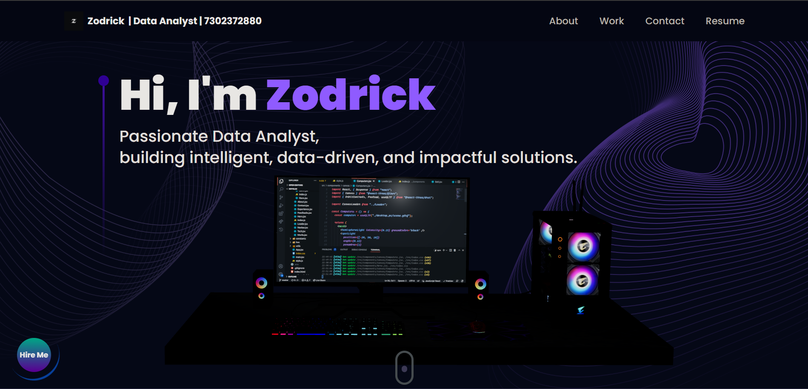

# 3D Portfolio Website

Welcome to my captivating 3D portfolio website project! Harnessing the power of cutting-edge technologies, I've crafted a mesmerizing and responsive portfolio site that's not just visually stunning but also incredibly easy for anyone to personalize.

## 🚀 Technologies Used
- **Three.js**: The magic behind this project, a potent 3D graphics library.
- **React Three Fiber**: Seamlessly integrate Three.js into React with this popular library.
- **Tailwind CSS**: Elevate your design game with this utility-first CSS framework.
- **Framer Motion**: Bring your website to life with captivating animations.

## ✨ Key Features
- **Stunning 3D Models**: Load, create, and customize breathtaking 3D models and geometries.
- **Lighting Magic**: Implement various lights to enhance the 3D visuals, creating a visually immersive experience.
- **Perfect Positioning**: Navigate the 3D world effortlessly with a camera and precisely position objects in space.
- **Scalable and Reusable**: Make your codebase highly reusable and scalable with Higher Order Components (HOCs) and industry-standard best practices.
- **Stay Connected**: Enable visitors to reach out with an integrated contact form that sends emails directly from your website.
- **Responsive Design**: Ensure your site looks fantastic on all devices, from desktops to smartphones.
- **Optimized Performance**: Employ Suspense and Preload techniques to deliver a blazing-fast user experience.

## 🌐 Live Demo
Experience it in action! [Live Demo 🚀](https://zodrick-portfolio.onrender.com/)

## 🛠️ Usage
You can easily create your own 3-D portfolio website using this project as a template. Just follow these steps:
1. Clone this repository.
2. Navigate to the project directory.
3. Run `npm install` to install dependencies.
4. Modify the data in `src/constants/index.js` with your own content.
5. Run `npm run dev` to start the development server.

Every piece of data on the website is dynamic and originates from the constants file. Simply change the data there, and you'll have your own stunning 3-D portfolio.

## 💡 Contributing
Contributions are warmly welcomed! Whether you have suggestions, bug reports, or want to add new features, please don't hesitate to open an issue or create a pull request.
